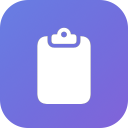

# Kopi

<p align="center">
  
</p>

<p align="center">
  <strong>A lightweight clipboard manager for macOS</strong><br>
  Text and image history, pinning, global hotkey, and smart search.
</p>

<p align="center">
  
  
  
</p>

---

## Why Kopi?

Most clipboard managers for macOS are either paid, closed-source, or text-only. Kopi is a free, open-source alternative that handles both **text and images** — built natively with Swift and SwiftUI.

*"Kopi" means "copy" in several languages.*

## Features

- **Clipboard monitoring** — Automatically captures text and images copied from any app (polls every 0.5s)
- **Image support** — Full image history with thumbnails, stored efficiently with hybrid blob/filesystem storage
- **Global hotkey** — Press `Ctrl+Space` to toggle the quick panel from anywhere (customizable)
- **Smart search** — Filter clipboard history by content, type (text/image), or pinned status
- **Pinning** — Pin frequently-used items so they persist beyond the auto-purge window
- **Auto-purge** — Automatically cleans up items older than 30 days (configurable)
- **Image deduplication** — SHA-256 hashing prevents duplicate images from cluttering history
- **Paste from history** — Click any item to paste it into the active app via simulated Cmd+V
- **History window** — Full browsing experience with master-detail layout and date grouping
- **Launch at login** — Optional, via the Settings panel
- **Menu bar app** — Lives in the menu bar, no Dock icon clutter

## Screenshots

### Quick Panel
Left-click the menu bar icon or press `Ctrl+Space` to open the quick panel:
- Search bar with smart filters (All / Text / Images / Pinned)
- Keyboard navigation: `Up/Down` to navigate, `Enter` to paste, `Backspace` to delete
- Right-click any item for additional actions (Paste, Pin, Delete)

### History Window
Right-click the menu bar icon and select "Open History" for the full browsing experience:
- NavigationSplitView with items grouped by date (Today, Yesterday, etc.)
- Detail pane with full content preview and action buttons (Pin, Copy, Delete)

### Settings
Right-click the menu bar icon and select "Settings..." to configure:
- **General** — Launch at login
- **Shortcuts** — Customize the global hotkey
- **Storage** — Set auto-purge duration, clear all history

## Requirements

- **macOS 14.6** or later
- **Accessibility permission** — Required for paste simulation (Cmd+V via CGEvent). The app prompts on first launch.

## Installation

### Build from Source

1. Clone the repository:
   ```bash
   git clone https://github.com/edufalcao/kopi-app.git
   cd kopi-app
   ```

2. Open the Xcode project:
   ```bash
   open Kopi/Kopi.xcodeproj
   ```

3. Build and run (`Cmd+R`) in Xcode.

4. Grant **Accessibility permission** when prompted (System Settings > Privacy & Security > Accessibility).

### Dependencies

Kopi uses two Swift packages (resolved automatically by Xcode):

| Package | Author | Purpose |
|---------|--------|---------|
| [KeyboardShortcuts](https://github.com/sindresorhus/KeyboardShortcuts) | Sindre Sorhus | Global hotkey with customizable recorder UI |
| [LaunchAtLogin-Modern](https://github.com/sindresorhus/LaunchAtLogin-Modern) | Sindre Sorhus | Toggle launch at login |

## Architecture

Kopi uses a **hybrid AppKit + SwiftUI** architecture:

```
KopiApp (SwiftUI App)
├── AppDelegate
│   ├── StatusItemManager      — NSStatusItem (menu bar icon), click handling
│   ├── ClipboardMonitor       — Timer-based NSPasteboard polling (0.5s)
│   ├── HotkeyManager          — Ctrl+Space via KeyboardShortcuts
│   └── PasteService            — Write to pasteboard + CGEvent Cmd+V
├── FloatingPanel (NSPanel)
│   └── QuickPanelView          — SwiftUI content via NSHostingView
├── History Window (NSWindow)
│   └── HistoryView             — SwiftUI NavigationSplitView
├── Settings (SwiftUI Settings scene)
│   └── SettingsView            — Hotkey, purge, launch-at-login
└── Services
    ├── ClipboardStore           — SwiftData CRUD, search, purge
    └── ImageStorageService      — Hybrid blob/filesystem storage
```

- **AppKit**: `NSStatusItem` (menu bar), `NSPanel` (floating quick panel), `NSWindow` (history)
- **SwiftUI**: All view content, settings window
- **SwiftData**: Persistence with `ClipboardItem` model

### Data Storage

- **Text items**: Stored in SwiftData as strings
- **Small images** (< 128KB): Stored as blobs in SwiftData
- **Large images** (>= 128KB): Saved to `~/Library/Application Support/Kopi/Images/` with a reference in SwiftData
- **Auto-purge**: Non-pinned items older than the configured threshold are deleted on app launch

## Usage

| Action | How |
|--------|-----|
| Open quick panel | Left-click menu bar icon or press `Ctrl+Space` |
| Navigate items | `Up/Down` arrow keys |
| Paste selected item | `Enter` or click the item |
| Delete selected item | `Backspace` |
| Pin/Delete/Paste | Right-click an item for context menu |
| Open history | Right-click menu bar icon > "Open History" |
| Open settings | Right-click menu bar icon > "Settings..." |
| Quit | Right-click menu bar icon > "Quit Kopi" |

## Development

### Running Tests

```bash
cd Kopi
xcodebuild test -scheme Kopi -destination 'platform=macOS' -only-testing KopiTests
```

The test suite covers:
- **ClipboardStore** — CRUD operations, search, filtering, purge logic, pinning (12 tests)
- **ImageStorageService** — Blob vs filesystem routing, SHA-256 hashing, file cleanup (6 tests)
- **ClipboardItemSearch** — Shared text and image search/filter behavior for the quick panel and history views (5 tests)
- **PasteboardChangeTracker** — Exact self-write tracking so external clipboard changes are not skipped after paste (3 tests)
- **Smoke coverage** — Base app test target wiring (1 test)

### Project Structure

```
kopi-app/
├── Kopi/
│   ├── Kopi/                    — App source
│   │   ├── Models/              — SwiftData model (ClipboardItem)
│   │   ├── Services/            — Business logic (store, monitor, paste, image storage)
│   │   ├── MenuBar/             — AppKit components (status item, floating panel)
│   │   ├── Views/               — SwiftUI views (panel, history, settings, shared)
│   │   └── Utilities/           — Hotkey manager
│   ├── KopiTests/               — Unit tests
│   └── Kopi.xcodeproj/
└── docs/                        — Design specs and implementation plans
```

## License

This project is licensed under the **GNU General Public License v3.0** — see the [LICENSE](LICENSE) file for details.

## Acknowledgments

- [KeyboardShortcuts](https://github.com/sindresorhus/KeyboardShortcuts) and [LaunchAtLogin-Modern](https://github.com/sindresorhus/LaunchAtLogin-Modern) by [Sindre Sorhus](https://github.com/sindresorhus)
- Inspired by [Maccy](https://github.com/p0deje/Maccy), [Paste](https://pasteapp.io), and other clipboard managers
